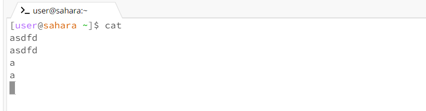

# CD Commands


**1. Command with no arguments**
```
[user@sahara ~]$ cd    
[user@sahara ~]$       //output
[user@sahara ~]$ pwd
/home
```
The reason why I got that output is because cd resets back to the root directory which is /home. <br>
This output is not an error <br>

**2. Command with a path to a directory as an argument**
```
[user@sahara ~]$ cd lecture 1
[user@sahara ~/lecture1]$   //output
[user@sahara ~]$ pwd
/home/lecture
```
The reason why I got that output is because it changed to the nearest directory which is the lecture1 folder. <br>
This output will only get an error if you input a directory that is not 1 directory deep. For example, the message folder is two directories deep from the /home directory and if I were to type 
>cd message

I would get this error
```
bash: cd: messages: No such file or directory
```

**3. Command with a path to a file as an argument**
```
[user@sahara ~]$ cd lecture1/Hello.java
//Output
bash: cd: lecture1/Hello.java: Not a directory
[user@sahara ~]$ pwd
/home
```
The reason why it shows an error in my output is because the java file is not a directory or a folder. The cd commands only works for folders or directory 

# LS Commands 

**1. Command with no argument**
    ```
    [user@sahara ~]$ls
    hello.txt lecture1  //output
    [user@sahara ~]$pwd
    /home

    ```
    The reason I got that output because it listed the files and directories it found in the current working<br>
    directory which is the \home
    
**2. Command with a path to a *directory* as an argument**
    ```
    [user@sahara ~]$ ls lecture1
    Hello.class  Hello.java  messages  README   //output
    [user@sahara ~]$pwd
    /home
    ```
    The reason why I got that output is because it listed the files and directories inside the lecture1 folders.
   
**3. Command with a path to a *file* as an argument**
   ```
   [user@sahara ~]$ ls lecture1/Hello.java
   lecture1/Hello.java //output
   [user@sahara ~]$pwd
   /home

   ```
   The reason why I got that output is because it listed the path the files is located in

# CAT Commands

**1. Command with *no* arguments**
    
**2. Command with a path to a *directory* as an argument**

**3. Command with a path to a *file* as an argument**
   
   
