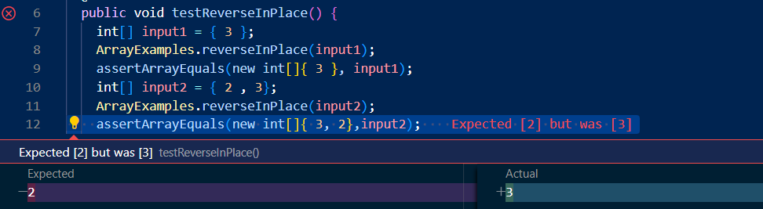
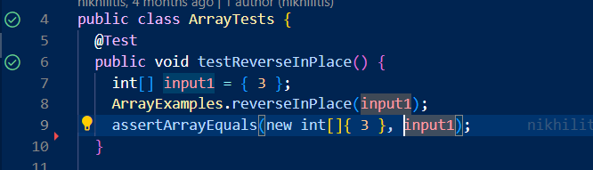

# Part 1 Bugs
I picked the reverseInPlace bug contained in the ArrayExamples.java.

Here is the J-Unit Test I wrote to detect the bug

```
public void testReverseInPlace() {
    int[] input1 = { 3 };
    ArrayExamples.reverseInPlace(input1);
    assertArrayEquals(new int[]{ 3 }, input1);
    int[] input2 = { 2 , 3};
    ArrayExamples.reverseInPlace(input2);
    assertArrayEquals(new int[]{ 3, 2},input2);
    int[] input3 = { 1 , 2 , 3};
    ArrayExamples.reverseInPlace(input3);
    assertArrayEquals(new int[]{ 3, 2, 1},input3);
}
```

Here is the J-Unit Test I wrote that doesn't detect the bug even though the bug is still in the program

```
public void testReverseInPlace() {
    int[] input1 = { 3 };
    ArrayExamples.reverseInPlace(input1);
    assertArrayEquals(new int[]{ 3 }, input1);
}
```

Here are the symptoms of running the test that induce a failure



Here are the symptoms of running the test that doesn't induce a failure



Here is the bug before the fix
```
static void reverseInPlace(int[] arr) {
    for(int i = 0; i < arr.length; i += 1) {
      arr[i] = arr[arr.length - i - 1];
    }
  }
```

Here is the bug (no longer a bug) after the fix

```
  static void reverseInPlace(int[] arr) {
    int[] tempArray = new int[arr.length];
    for(int i = 0; i < arr.length; i++){
      tempArray[i] = arr[i];
    }
    for(int i = 0; i < arr.length; i += 1) {
      arr[i] = tempArray[arr.length - i - 1];
    }
  }
```

The fix I made to the bug fixed the issue my test found when testing if input2 would change from {2,3} to {3,2} if called 
the reverseInPlace method.
How the bug caused that symptom is when input2 went through its first iteration, it was changed to {3,3}. Then in the second iteration, element 2 is no longer there because of the first iteration, resulting in the final array of being {3,3}. 
To prevent the original element from disappearing, I made a temp array to contain those elements and used it to directly modify int[] arr. 


# Part 2 Researching Commands

I will be researching four different command-line options for `find`

1. `find -name`:This command is useful because it helps find the name of a specific file or a specific type of file. Then it prints it out which file

Example 1: 

```
[user@sahara ~/docsearch/technical]$ find . -name chapter-1.txt
```
Output
```
./911report/chapter-1.txt
```
Example 2:
```
[user@sahara ~/docsearch/technical]$ find . -name *.txt
```
Output
```
./biomed/1471-2105-3-6.txt
./biomed/1476-069X-1-3.txt
./biomed/1475-9268-1-1.txt
./biomed/bcr620.txt
./biomed/1472-6882-1-12.txt
./biomed/1471-2407-3-4.txt
./biomed/bcr294.txt
./biomed/1477-7827-1-23.txt
./biomed/1476-5918-1-2.txt
./biomed/1471-2164-4-21.txt
./biomed/ar68.txt
./biomed/1471-2407-2-16.txt
./biomed/1471-2180-1-7.txt
./biomed/1471-2148-2-7.txt
./biomed/1472-6963-3-13.txt
./biomed/1471-2210-2-4.txt
./biomed/1472-6882-2-5.txt
./biomed/1471-2180-1-29.txt
./biomed/1471-230X-1-8.txt
./biomed/1471-2105-3-28.txt
./biomed/1471-2164-3-9.txt
...
//all the txt file found in the technical directory
```

2. `find -link`: This command is useful because it helps detect which file has *n* links. Then it prints it out which file

Example 1:
```
[user@sahara ~/docsearch/technical]$ find . -links 1
```
Output
```
./biomed/1471-2105-3-6.txt
./biomed/1476-069X-1-3.txt
./biomed/1475-9268-1-1.txt
./biomed/bcr620.txt
./biomed/1472-6882-1-12.txt
./biomed/1471-2407-3-4.txt
./biomed/bcr294.txt
./biomed/1477-7827-1-23.txt
./biomed/1476-5918-1-2.txt
./biomed/1471-2164-4-21.txt
./biomed/ar68.txt
./biomed/1471-2407-2-16.txt
./biomed/1471-2180-1-7.txt
./biomed/1471-2148-2-7.txt
./biomed/1472-6963-3-13.txt
./biomed/1471-2210-2-4.txt
./biomed/1472-6882-2-5.txt
./biomed/1471-2180-1-29.txt
./biomed/1471-230X-1-8.txt
./biomed/1471-2105-3-28.txt
./biomed/1471-2164-3-9.txt
./biomed/1471-2288-2-10.txt
./biomed/1471-2334-3-11.txt
./biomed/1471-2148-1-4.txt
./biomed/1471-2164-3-1.txt
...
//all other files that have an attached link inside it
```
Example 2
```
[user@sahara ~/docsearch/technical]$ find . -links 2
```
Output
```
./biomed
./911report
```

3. `find -type` : This command is useful because it can find what type of files is available. Then it prints it out. According
to `man find`, the argument after -type is 'b', 'c', 'd', 'l', 'p', 'f', or 's' for block special file, character special file, directory, symbolic link, FIFO, regular file, or socket, respectively.

Example 1:
```
[user@sahara ~/docsearch/technical]$ find . -type d
```
Output
```
.
./biomed
./911report
```

Example 2:
```
[user@sahara ~/docsearch/technical]$ find . -type f
```
Output
```
./biomed/1471-2105-3-6.txt
./biomed/1476-069X-1-3.txt
./biomed/1475-9268-1-1.txt
./biomed/bcr620.txt
./biomed/1472-6882-1-12.txt
./biomed/1471-2407-3-4.txt
./biomed/bcr294.txt
./biomed/1477-7827-1-23.txt
./biomed/1476-5918-1-2.txt
./biomed/1471-2164-4-21.txt
./biomed/ar68.txt
./biomed/1471-2407-2-16.txt
./biomed/1471-2180-1-7.txt
./biomed/1471-2148-2-7.txt
./biomed/1472-6963-3-13.txt
./biomed/1471-2210-2-4.txt
./biomed/1472-6882-2-5.txt
./biomed/1471-2180-1-29.txt
./biomed/1471-230X-1-8.txt
./biomed/1471-2105-3-28.txt
./biomed/1471-2164-3-9.txt
...
//listed all regular files which are .txt files
```

4. `find -newer`: this command is useful because it can the files that are modify more than a file you put in as an argument. This command then prints out the files that it find

Example 1
```
[user@sahara ~/docsearch/technical]$ find . -newer 911report/chapter-1.txt
```
Output
```
.
./biomed
./biomed/1471-2105-3-6.txt
./biomed/1476-069X-1-3.txt
./biomed/1475-9268-1-1.txt
./biomed/bcr620.txt
./biomed/1472-6882-1-12.txt
./biomed/1471-2407-3-4.txt
./biomed/bcr294.txt
./biomed/1477-7827-1-23.txt
./biomed/1476-5918-1-2.txt
./biomed/1471-2164-4-21.txt
./biomed/ar68.txt
./biomed/1471-2407-2-16.txt
./biomed/1471-2180-1-7.txt
./biomed/1471-2148-2-7.txt
./biomed/1472-6963-3-13.txt
./biomed/1471-2210-2-4.txt
./biomed/1472-6882-2-5.txt
./biomed/1471-2180-1-29.txt
...
// all other files it found that is modify more than chapter-1.txt
```

Example 2
```
[user@sahara ~/docsearch/technical]$ find . -newer 911report/chapter-1.txt
```
Output
```
./911report/chapter-2.txt

//I got this output because I modified chapter 1 by adding 1 line and modified chapter-2.txt by adding two lines
```


