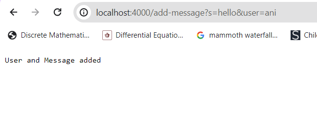
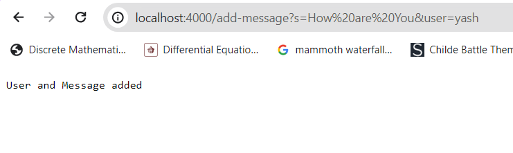
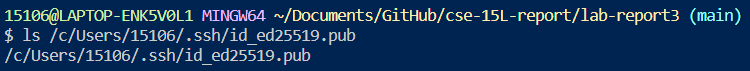
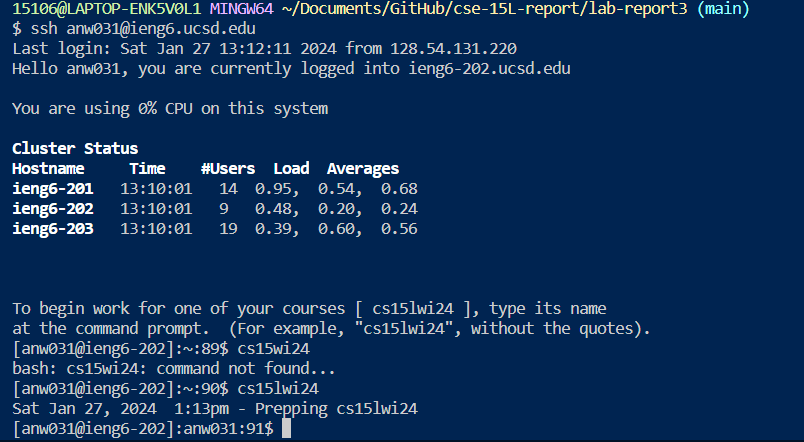

# Part 1



I used the NumberServer.java template from Week 2 lab and modify it to accept strings. I don't necessarily use a method but the handler method
which is in the main method of the ChatServer. I think the relevant arguments are the queries because we're outputting the words inputted after
the "=". 
As for values when I put in an integer after the =, it converts it into a string and still outputs it. 



When I added another message and user, it was added to the same ArrayList that contains the first pair of messages and users. It shares the same relevant arguments as the first pair of messages and users. It can also takes in integer as a string and still outputs it.
```
import java.io.IOException;
import java.net.URI;
import java.util.*;
class Handler implements URLHandler{
    ArrayList<String> message = new ArrayList<String>();
    ArrayList<String> user = new ArrayList<String>();
    public String handleRequest(URI url){
        if(url.getPath().equals("/")){  //detects path
            if(user.size() == 0 && message.size() == 0){
                return "Nothing";
            }else{

                StringBuilder result = new StringBuilder();
                //iterating through the messages
                for(int i = 0; i< message.size(); i++){
                    result.append(user.get(i)).append(" : ").append(message.get(i)).append("\n");
                }
                return result.toString();
            }
        }else{
            if(url.getPath().contains("/add-message")){
                String query = url.getQuery(); //string contains the query after the ?
                String[] parameters = query.split("&"); //splits the message and user
                for (String words : parameters) { //iterate through the two elements (message and user) in parameters[]
                    String[] userInput = words.split("=");
                    if (userInput[0].equals("s")) { //words inputed after s
                        message.add(userInput[1]);
                    } else {
                        if (userInput[0].equals("user")){ //words inputed after user
                            user.add(userInput[1]);
                        }
                    }
                }
                return "User and Message added";
            }
            return "404 Not Found:";
        }
    }

}

class ChatServer {
    public static void main(String[] args) throws IOException {
        if(args.length == 0){
            System.out.println("Missing port number! Try any number between 1024 to 49151");
            return;
        }

        int port = Integer.parseInt(args[0]);

        Server.start(port, new Handler());
    }
}
```

# Part 2






# Part 3

I didn't know that I could see all the files I downloaded in my download folder. I also didn't know that Java is capable of making a website server because I thought only JavaScript or any front-end/back-end languages could do that. I think it was cool that we could connect to the CSE computers and have access to our data. I wonder if it only works if we're in UCSD or somewhere else. 
