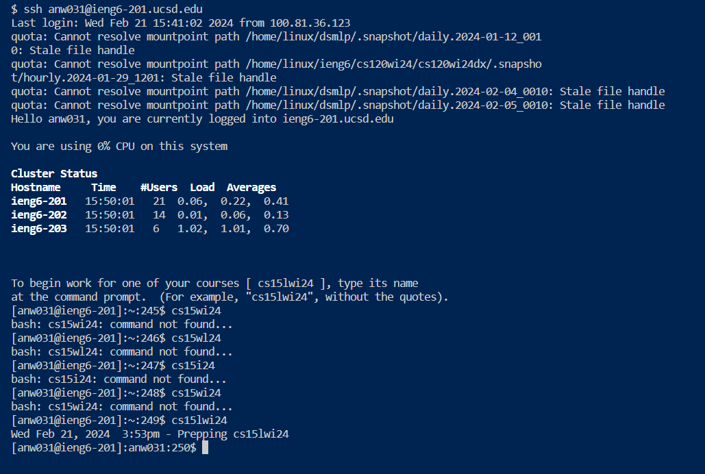
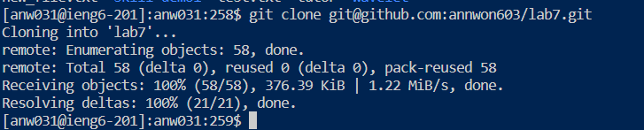
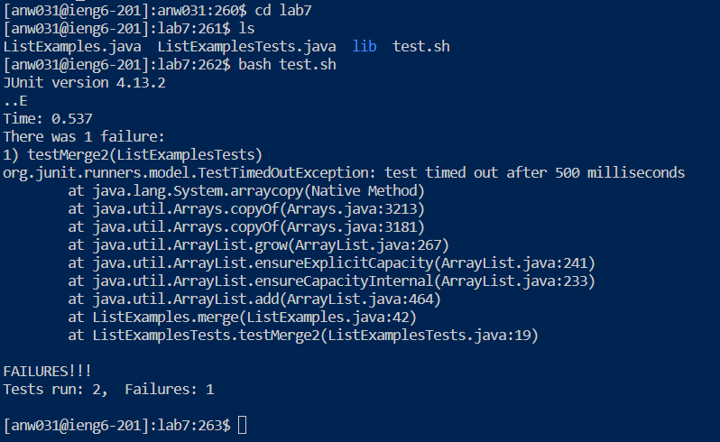
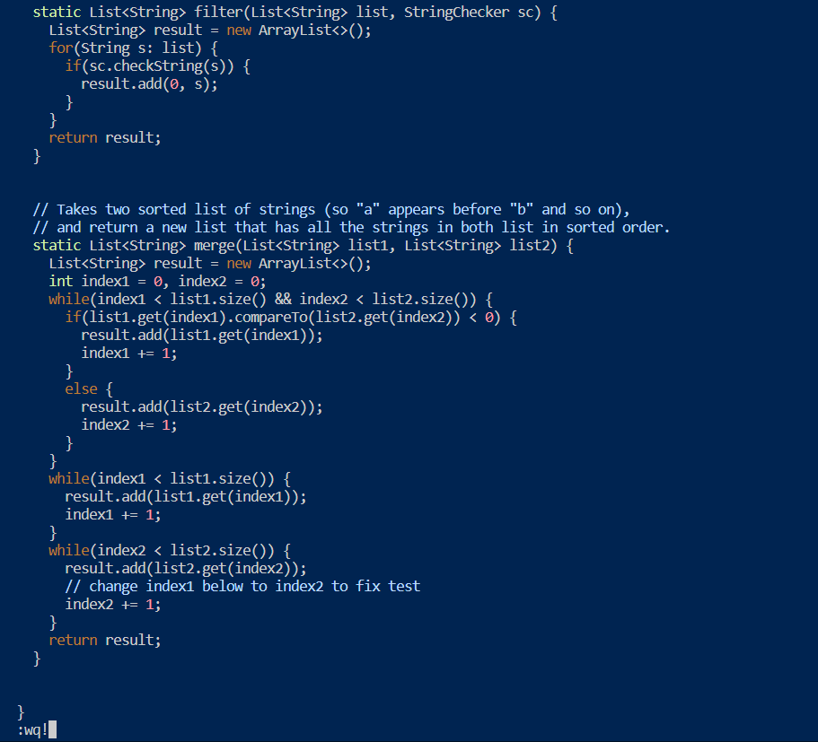
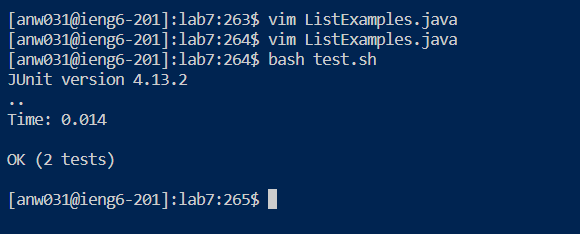
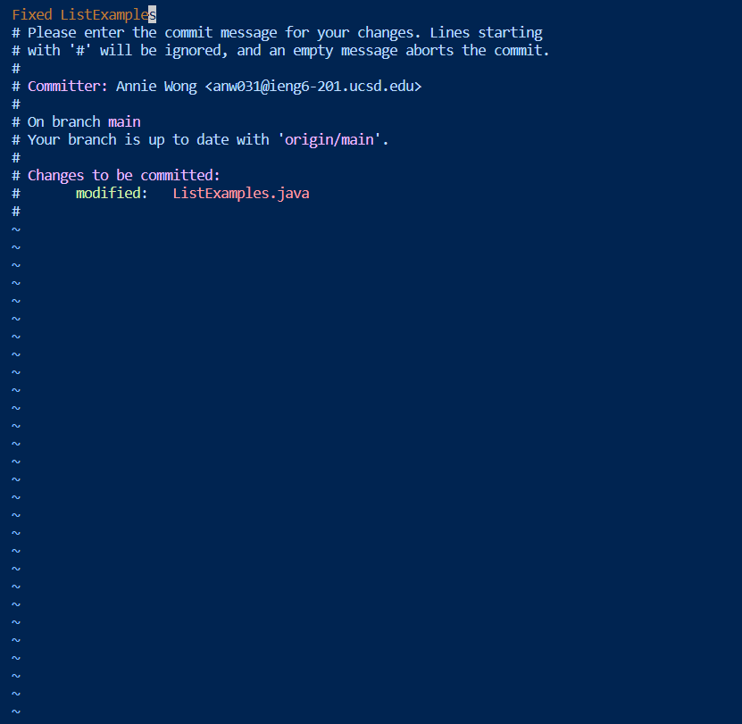
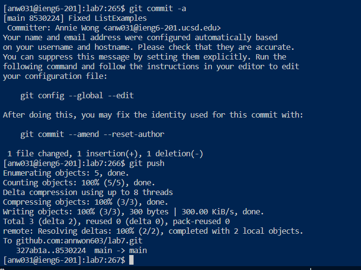

# CSE 15L Lab Report 4 #

## Step 4 ##

I typed in `ssh anw031@ieng6-201.ucsd.edu` into the terminal.
Then I pressed `enter`
Then I typed in `cs15lwi24`
Then I pressed `enter`

## Step 5 ##

I typed in `git clone` and then pasted my SSH URL which is `git@github.com:annwon603/lab7.git`.
Then I pressed `enter`

## Step 6 ##

I typed in `cd lab7` and pressed `enter`. Then I typed and `enter` `ls` to check what files are there.
Then I typed and `enter` `bash test.sh`

# Step 7 #

I typed and `enter` `vim ListExamples.java`. Then I pressed the up arrow key four times, then right arrow key 11 times, and press `x`.
I then pressed `i` and then pressed `2`. Then I pressed `ESC`, then I typed and entered `:wq!`

# Step 8 #

I typed and `enter` `bash test.sh`

# Step 9 #

I typed and `enter` `git commit -a`, then I press `i` and then type in the message `Fix ListExamples` . I then pressed `ESC` and typed in `:wq!`

Then I typed and `enter` `git push`

