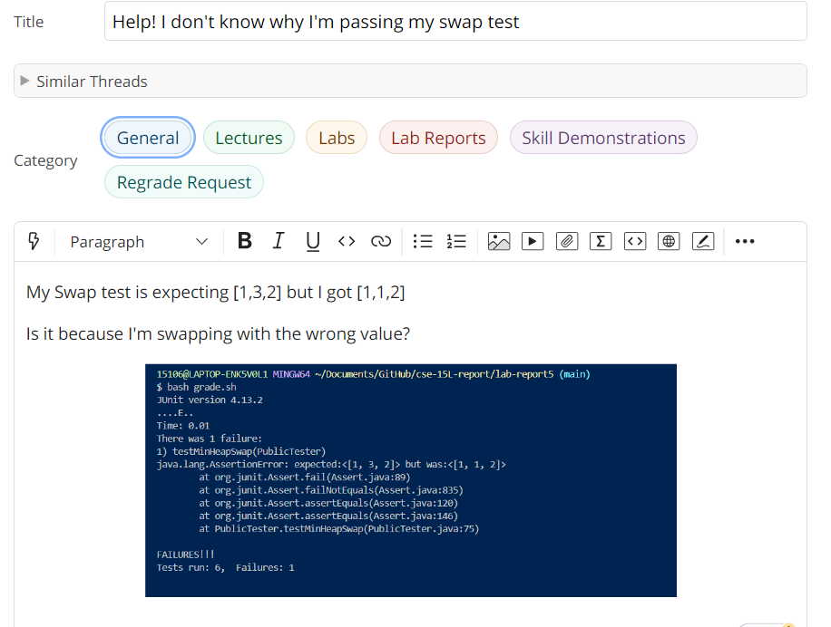

# CSE 15L Lab Report 5 #

### Part 1 ###
## Student ##

## TA ##

## Student ##

## TA ##

## Student ##

### Part 2 ###
It's interesting to learn about `vim` during the second half of this quarter. I can see myself 
using `vim` in the future because I know I will make tons of revisions to my code and `vim` might
save me tons of time for that. I also learned how to use `jdb` and I never thought it would be possible
to debug the code via terminal. I wish I could have understood more about `grep` and other commands we covered in Week 5 because they seem useful for manipulating and accessing files but there are too many commands for me to memorize at once. 
